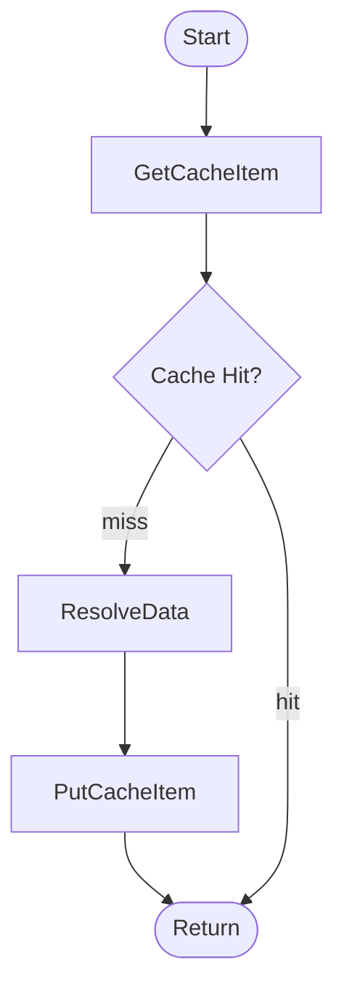

This repo shows how you can use [Momento](https://www.gomomento.com/) as a cache layer with AWS AppSync resolvers, without using any Lambda function.

# Overview

In this demo, we want to query the [wikipedia API](https://en.wikipedia.org/w/api.php) through AWS AppSync. In order to avoid overwhelming the wiki and return results faster for recurrent requests, we use Momento as a caching layer.

# How It Works. TL;DR;

Under the hood, Momento works with an [HTTP API](https://www.postman.com/momento-allen/workspace/momento/overview) which allows you to read and write cache items. This solution uses AppSync [pipeline resolvers](https://docs.aws.amazon.com/appsync/latest/devguide/tutorial-pipeline-resolvers.html) with an HTTP data source in order to get an item from cache. When there is a cachehit, the data is returned immediately. Otherwise, the data is resolved and then saved into the cache.

# Considerations & Going Further.

This is a proof of concept for learning purpose only. Before using this for production workloads, there are some considerations and improvements that could be taken:

- compare with "native" [AppSync caching](https://docs.aws.amazon.com/appsync/latest/devguide/enabling-caching.html) feature.
- use hooks/scripts to auto generate or renew cache instances before deploying.
- store tokens securely somewhere (e.g. on [Secret Manager](https://docs.aws.amazon.com/secretsmanager/latest/userguide/intro.html)).
- use short-lived momento tokens and [auto-renew](https://github.com/momentohq/auth-token-refresh-lambda) them.
- etc.

# How to deploy?

- [Generate a momento token](https://docs.momentohq.com/getting-started)
- Create a (secured) SSM parameter named `/momento/cache/token` and store your momento token in it.
- `npm i`
- `npx sls deploy`
